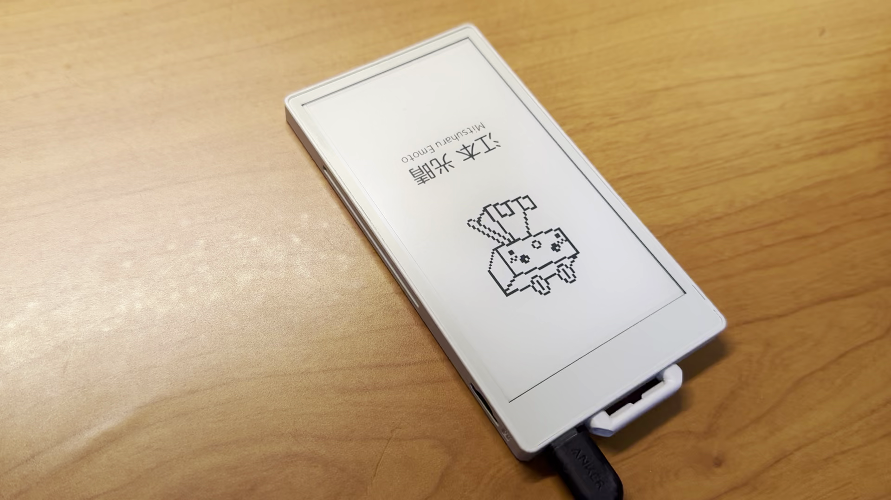

# CardCase For M5PaperS3

M5PaperS3 を対象にして、SD カードに保存した画像を選択して表示します。いろんな画像を保存して、シーンに合わせて画像を切り替えましょう。

## Demo

## Requirements

- M5PaperS3
- VS Code + PlatformIO

## Usage

- 最大 10 枚の 540 x 960 ピクセルの画像（jpeg または png）を SD カードに保存してください
- 再選択は電源ボタンを押してリセットしてくだしあ